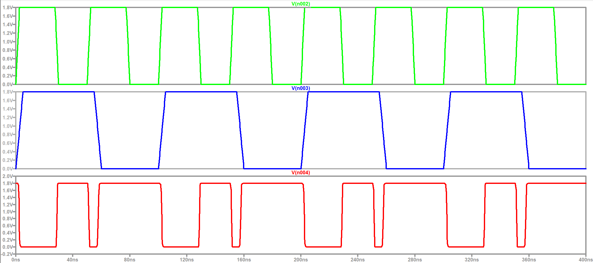
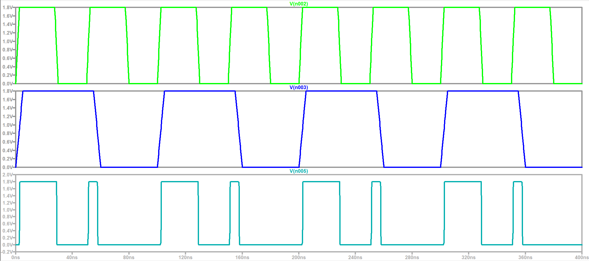
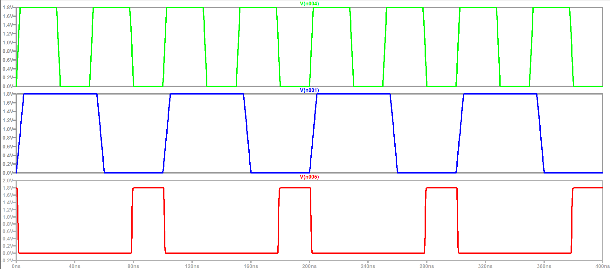
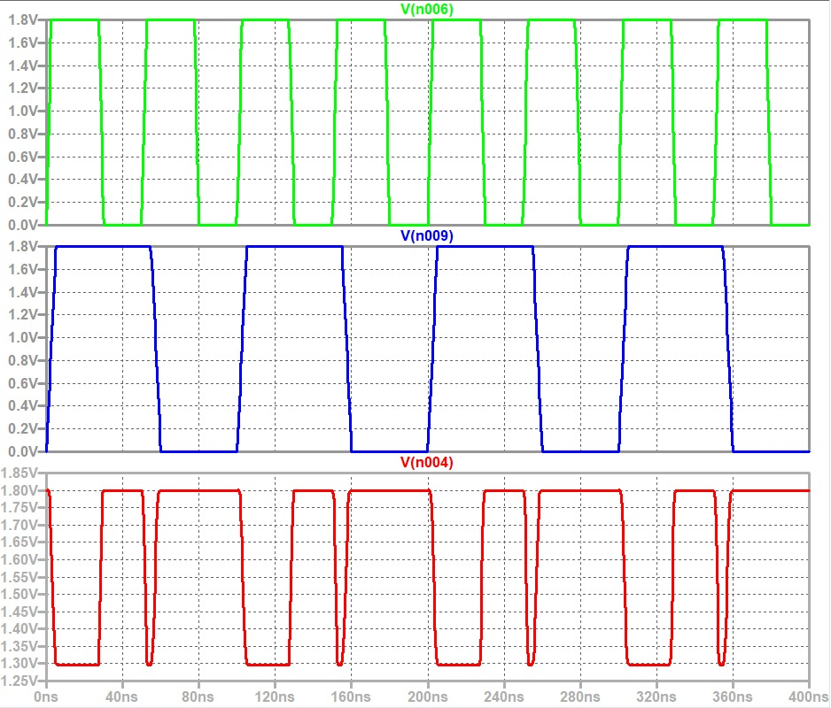
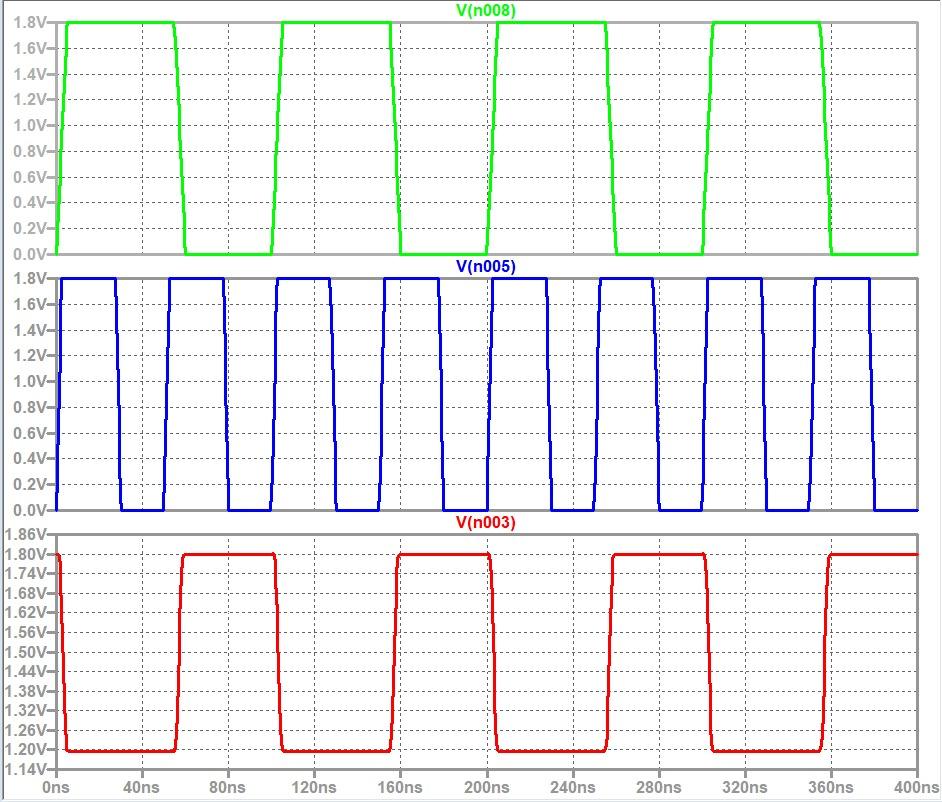

<div align="center">

# CMOS Logic Gates — Static CMOS vs. Ratioed Logic

### 2-input NAND, AND, and NOR gates in two competing design styles — TSMC 180 nm, LTSpice


[Contents](#-contents) · [Design Trade-off](#-the-core-design-trade-off) · [Tools](#-tools--environment) · [Comparative Summary](#-comparative-summary) · [Author](#-author)

</div>

---

## 📌 Overview

Every Boolean function in a digital IC can be built from NAND, AND, and NOR gates — but *how* those gates are built at the transistor level involves a real design trade-off. This repository implements the same 2-input NAND and NOR gates (plus AND, derived from NAND) in **two competing CMOS design styles**, using the TSMC 180 nm process library (`tsmc018.lib`) throughout:

- **Static CMOS** — a full complementary pull-up/pull-down network, giving rail-to-rail output and zero static power, at the cost of more transistors.
- **Ratioed Logic** — a single always-ON weak PMOS pull-up instead of a full network, using fewer transistors, but at the cost of non-rail-to-rail output and static power dissipation.

Each style is fully characterized: transient truth-table verification, propagation delay measurement, and (for ratioed logic) noise margin calculation — letting the two be compared directly, gate for gate.

---

## 📖 Contents

### [Static CMOS Logic Gates — NAND, AND, NOR](static-cmos-logic-gates/)

Implements 2-input NAND, AND (NAND + inverter), and NOR gates using full complementary pull-up/pull-down networks, verifying truth-table-correct rail-to-rail switching and comparing propagation delay across all three.

<p align="center">
  
  
  
</p>

**Core result:** all three gates swing perfectly rail-to-rail (0 V / 1.8 V); NAND is fastest (t_p = 53 ps), AND is slowest due to its two-stage structure (t_p = 100 ps), and NOR shows asymmetric delay from its slower series-PMOS pull-up (t_p = 63 ps).

### [Ratioed Logic Gates — NAND, NOR](ratioed-logic-gates/)

Rebuilds the NAND and NOR gates using a single always-ON weak PMOS pull-up instead of a full complementary network, trading transistor count for output-swing and noise-margin degradation.

<p align="center">
  
  
</p>

**Core result:** neither gate reaches 0 V at output LOW (V_OL ≈ 1.30 V for NAND, ≈1.20 V for NOR), driving NM_L negative for both (−0.40 V and −0.30 V respectively) — a direct, measured demonstration of why ratioed logic is unsuitable for large cascaded digital systems despite its smaller transistor count and comparable speed.

---

## ⚖️ The Core Design Trade-off

Both styles implement the *same Boolean functions*, with the *same pull-down network topology* (NMOS in series for NAND, NMOS in parallel for NOR) — the only real difference is the pull-up network:

| | Static CMOS | Ratioed Logic |
|---|---|---|
| **Pull-up network** | Full complementary PUN (2 PMOS per 2-input gate) | 1 always-ON weak PMOS |
| **Pull-down network** | Same NMOS topology in both styles | Same NMOS topology in both styles |
| **Transistor count (2-input gate)** | 4 | 3 |
| **Output swing** | Rail-to-rail (V_OL = 0 V, V_OH = V_DD) | V_OL > 0 V (not rail-to-rail) |
| **Static power** | None (exactly one network conducts at a time) | Present whenever output is LOW (both networks fight) |
| **NM_L (measured)** | Large (rail-to-rail ⇒ full margin) | Negative for both gates (−0.40 V NAND, −0.30 V NOR) |
| **Best suited for** | General-purpose digital logic, large cascaded systems | Area-constrained designs where static power and limited fan-out are acceptable |

This is exactly the trade-off real IC designers face when choosing a logic family: **static CMOS costs more transistors but "just works" when cascaded**, while **ratioed logic saves area and can be faster per-gate, but degrades noise immunity to the point that cascading many stages becomes unreliable** — as directly confirmed by the negative NM_L measured here.

---

## 🛠️ Tools & Environment

| Tool | Purpose |
|---|---|
| **LTSpice** | SPICE-based digital circuit simulator used for transient (`.tran`) analysis and truth-table verification |
| **TSMC 180 nm library (`tsmc018.lib`)** | Foundry-representative CMOSP/CMOSN device models used throughout both design styles |

All simulation decks are plain-text SPICE netlists, included in each section's `code/` folder — directly importable/reusable in LTSpice.

---

## 📊 Comparative Summary

| Gate | Style | t_pHL (ps) | t_pLH (ps) | t_p (ps) | V_OL (V) | NM_L (V) |
|---|---|---|---|---|---|---|
| NAND | Static CMOS | 62 | 44 | 53 | 0.00 | Large (rail-to-rail) |
| NAND | Ratioed Logic | 55 | 30 | 42.5 | ≈1.30 | −0.40 |
| NOR | Static CMOS | 38 | 88 | 63 | 0.00 | Large (rail-to-rail) |
| NOR | Ratioed Logic | 35 | 28 | 31.5 | ≈1.20 | −0.30 |
| AND | Static CMOS (NAND+INV) | 108 | 92 | 100 | 0.00 | Large (rail-to-rail) |

Ratioed logic gates are modestly *faster* per-gate (lower t_p) than their static CMOS counterparts, but this speed advantage comes paired with a **negative low-state noise margin** in both cases — the central finding of this repository.

---

## 📁 Repository Structure

```
LTSpice-CMOS-Logic-Gates/
├── README.md
├── LICENSE
├── .gitignore
├── static-cmos-logic-gates/
│   ├── README.md
│   ├── code/
│   │   └── static_cmos_gates.cir
│   └── images/ (6 files)
└── ratioed-logic-gates/
    ├── README.md
    ├── code/
    │   └── ratioed_logic_gates.cir
    └── images/ (4 files)
```

---

## 👨‍💻 Author

<div align="center">

**Divyanshu Kumar**

B.Tech (Electronics & Communication Engineering) · University of Delhi

[](https://gignova.netlify.app)
[](https://www.linkedin.com/in/divyanshu-kumar-7625a8315)
[](https://github.com/Divyanshukumar2005)

</div>

---

<div align="center">

⭐ **If you found this project useful or interesting, consider giving it a star!**

</div>
