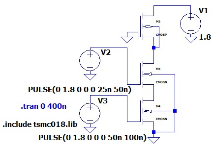
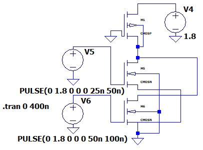

# Implementation of Logic Gates Using Ratioed Logic

## Aim

To implement and simulate 2-input logic gates using Ratioed Logic in LTSpice with TSMC 180 nm process parameters (`tsmc018.lib`), and to:

1. Design and simulate a 2-input **NAND gate** using Ratioed Logic.
2. Design and simulate a 2-input **NOR gate** using Ratioed Logic.
3. Verify the transient output waveforms for both gates.
4. Calculate the noise margins (NM_H and NM_L) for each gate.
5. Calculate the propagation delay for each gate.

## Apparatus Required

- Computer system with LTSpice simulation software
- TSMC 180 nm CMOS model library (`tsmc018.lib`)

---

## Theory

### Ratioed Logic

Ratioed Logic is a digital design style in which the output voltage level depends on the transistor size ratio (W/L) rather than complementary switching. Unlike [static CMOS](../static-cmos-logic-gates/), it does not use a complete Pull-Up Network (PUN). Instead, a single weak PMOS transistor is kept always ON as the pull-up load, while NMOS transistors form the Pull-Down Network (PDN).

Important characteristics:
1. PMOS and NMOS transistors may conduct simultaneously, producing static DC current.
2. Output voltage is not fully rail-to-rail, so V_OL > 0 V.
3. Static power dissipation occurs when output is LOW.
4. Fewer transistors are required — n+1 for an n-input gate (vs. 2n for static CMOS).

### 2-Input Ratioed NAND Gate

Produces a LOW output only when both inputs are HIGH.
- **Pull-Up Network:** one weak PMOS transistor, always ON.
- **Pull-Down Network:** two NMOS transistors in series.

When both inputs become HIGH, the NMOS transistors create a path to ground and pull the output LOW. The final LOW output voltage is determined by current balance between the always-ON PMOS and the conducting NMOS stack.

| A | B | Y = A·B (NAND) |
|---|---|---|
| 0 | 0 | 1 |
| 0 | 1 | 1 |
| 1 | 0 | 1 |
| 1 | 1 | 0 |

### 2-Input Ratioed NOR Gate

Produces a HIGH output only when both inputs are LOW.
- **Pull-Up Network:** one weak PMOS transistor, always ON.
- **Pull-Down Network:** two NMOS transistors in parallel.

If either input becomes HIGH, the corresponding NMOS transistor turns ON and pulls the output LOW.

| A | B | Y = A+B (NOR) |
|---|---|---|
| 0 | 0 | 1 |
| 0 | 1 | 0 |
| 1 | 0 | 0 |
| 1 | 1 | 0 |

### Noise Margins

```
NMH = VOH − VIH
NML = VIL − VOL
```

Using the 50% threshold approximation: `VIH = VIL = 0.5·VDD = 0.9 V`. Since V_OL is greater than zero in ratioed logic (unlike static CMOS), the LOW noise margin is reduced — and can even go negative, as shown in the results below.

### Propagation Delay

Measured at 50% of the supply voltage, the same convention used throughout this repository:
```
tpHL = time from input crossing 50% to output falling to 50%
tpLH = time from input crossing 50% to output rising to 50%
tp   = (tpHL + tpLH) / 2
```

---

## LTSpice Simulation

### Input Signal Configuration

- **VA (Input A):** `PULSE(0 1.8 0 0 0 25n 50n)` — period 50 ns, pulse width 25 ns.
- **VB (Input B):** `PULSE(0 1.8 0 0 0 50n 100n)` — period 100 ns, pulse width 50 ns.

[`code/ratioed_logic_gates.cir`](code/ratioed_logic_gates.cir) implements both gates: the NAND core (one always-ON PMOS pull-up plus a series NMOS pull-down pair) and the NOR core (one always-ON PMOS pull-up plus a parallel NMOS pull-down pair).

### Ratioed NAND Gate Circuit

The 2-input ratioed NAND gate consists of three transistors: PMOS M2 with its gate tied to GND as a permanent weak pull-up, and NMOS M3 and M4 in series forming the PDN. Input A drives the gate of M3; Input B drives the gate of M4.



*2-input Ratioed NAND gate schematic in LTSpice.*

### Ratioed NOR Gate Circuit

The 2-input ratioed NOR gate consists of three transistors: PMOS M1 with its gate tied to GND as a permanent weak pull-up, and two NMOS transistors in parallel forming the PDN.



*2-input Ratioed NOR gate schematic in LTSpice.*

---

## Results

### Ratioed NAND Gate Transient Results


*Transient waveforms for Ratioed NAND gate showing Input A (green), Input B (magenta), and NAND output (red).*

The output remains HIGH (≈1.8 V) for all input combinations except when both inputs are simultaneously HIGH, where it settles at V_OL ≈ 1.30 V — confirming correct NAND gate operation. Unlike static CMOS, the output does not reach 0 V, due to the always-conducting PMOS pull-up fighting the NMOS pull-down network.

### Ratioed NOR Gate Transient Results


*Transient waveforms for Ratioed NOR gate showing Input A (magenta), Input B (green), and NOR output (red).*

The output is HIGH (≈1.8 V) only when both inputs are LOW. The moment either input goes HIGH, the output is pulled LOW to V_OL ≈ 1.20 V, consistent with the NOR truth table. The NOR achieves a lower V_OL than the NAND because the parallel NMOS configuration provides stronger combined pull-down current.

### Truth Table Verification (V_DD = 1.8 V)

| Input A | Input B | NAND Output | NOR Output |
|---|---|---|---|
| 0 | 0 | 1 | 1 |
| 0 | 1 | 1 | 0 |
| 1 | 0 | 1 | 0 |
| 1 | 1 | 0 | 0 |

### Noise Margin Calculations

Using V_IH = V_IL = 0.9 V (50% of V_DD), V_OH = 1.80 V, V_OL ≈ 1.30 V (NAND) and V_OL ≈ 1.20 V (NOR), as observed from the transient waveforms:

```
NMH             = VOH − VIH = 1.80 − 0.90 = +0.90 V   (both gates)
NML (NAND)      = VIL − VOL = 0.90 − 1.30 = −0.40 V
NML (NOR)       = VIL − VOL = 0.90 − 1.20 = −0.30 V
```

| Gate | V_OH (V) | V_OL (V) | NM_H (V) | NM_L (V) |
|---|---|---|---|---|
| Ratioed NAND | 1.80 | ≈1.30 | +0.90 | −0.40 |
| Ratioed NOR | 1.80 | ≈1.20 | +0.90 | −0.30 |

*(V_DD = 1.8 V, TSMC 180 nm)*

The negative NM_L for both gates confirms that the LOW output level exceeds the switching threshold of the driven gate, making cascaded logic operation unreliable.

### Propagation Delay Measurements

| Gate | t_pHL (ps) | t_pLH (ps) | t_p (ps) |
|---|---|---|---|
| Ratioed NAND | 55 | 30 | 42.5 |
| Ratioed NOR | 35 | 28 | 31.5 |

*(V_DD = 1.8 V, TSMC 180 nm)*

The ratioed NOR gate is faster than the ratioed NAND gate because the parallel NMOS pull-down discharges the output more quickly than the series NMOS stack. The t_pLH values are smaller for both gates compared to static CMOS, since the always-ON PMOS begins charging the output immediately without any switching delay.

---

## Discussion

Transient simulation results show that both ratioed NAND and NOR gates follow their correct truth tables. However, unlike static CMOS, the output is not rail-to-rail. The LOW output level is approximately 1.30 V for NAND and 1.20 V for NOR instead of the ideal 0 V.

This occurs because the PMOS pull-up transistor remains always ON. When the NMOS pull-down network turns ON, both networks conduct simultaneously and the output voltage settles according to the transistor size ratio.

Noise margin analysis shows that NM_L is negative for both gates, making cascaded operation unreliable. However, the HIGH noise margin remains acceptable since the output HIGH level is close to V_DD.

The NOR gate gives lower V_OL and faster delay than the NAND gate because its parallel NMOS network provides stronger pull-down action.

Ratioed logic also consumes static power whenever the output is LOW, due to the continuous current path between supply and ground. Therefore, it is less suitable for low-power large-scale designs — a direct trade-off against the [static CMOS gates](../static-cmos-logic-gates/) covered elsewhere in this repository, which use exactly twice as many transistors but achieve rail-to-rail output and zero static power.

## Conclusion

2-input NAND and NOR gates were successfully designed and simulated using Ratioed Logic in LTSpice with the TSMC 180 nm process library. The transient waveforms confirmed correct Boolean operation for all input combinations. Noise margins and propagation delays were measured and compared: NM_L is negative for both gates (−0.40 V for NAND, −0.30 V for NOR) due to the non-zero V_OL caused by the always-ON PMOS pull-up, making cascaded logic unreliable. The ratioed NOR gate is faster (t_p = 31.5 ps) than the ratioed NAND gate (t_p = 42.5 ps) due to its stronger parallel pull-down network. The results highlight the fundamental trade-off of ratioed logic: improved speed and lower transistor count, at the cost of degraded noise margins and static power dissipation.
