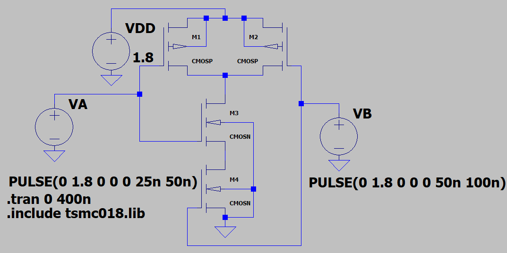
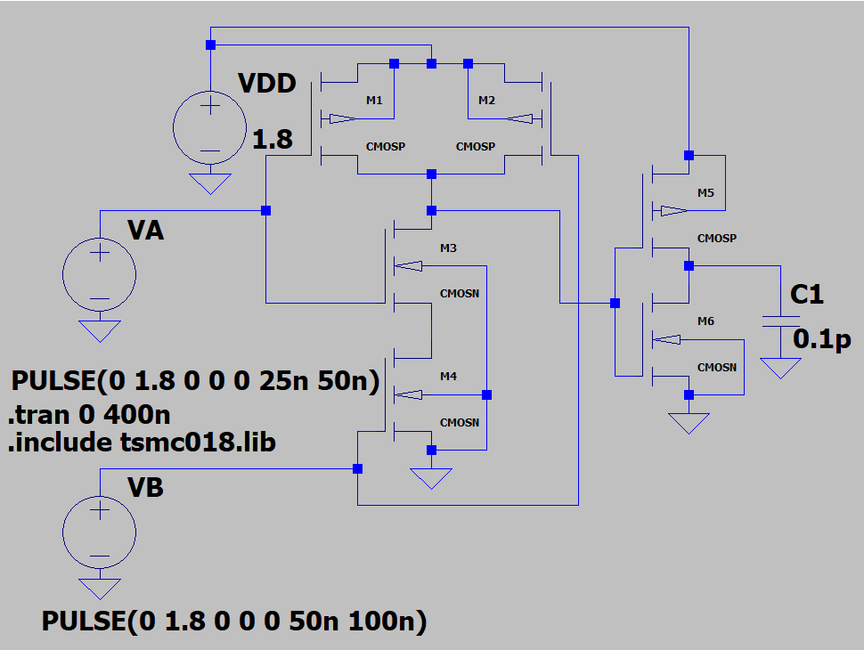
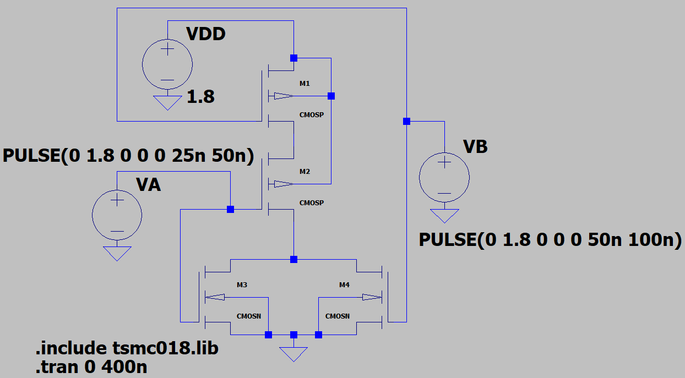

# Implementation of Logic Gates Using Static CMOS Technology

## Aim

To implement and simulate 2-input logic gates using static CMOS technology in LTSpice with TSMC 180 nm process parameters (`tsmc018.lib`), and to:

1. Design and simulate a 2-input **NAND gate** using static CMOS.
2. Design and simulate a 2-input **AND gate** (NAND + Inverter) using static CMOS.
3. Design and simulate a 2-input **NOR gate** using static CMOS.
4. Verify the transient output waveforms for all three gates.
5. Calculate the propagation delay for each gate.

## Apparatus Required

- Computer system with LTSpice simulation software
- TSMC 180 nm CMOS model library (`tsmc018.lib`)
- PMOS transistors (CMOSP), NMOS transistors (CMOSN)
- Supply voltage V_DD = 1.8 V

---

## Theory

### Static CMOS Logic

Static CMOS logic implements Boolean functions using two complementary networks:

- **Pull-Up Network (PUN):** composed of PMOS transistors. Connects the output to V_DD when the output should be logic HIGH. Connected in a dual (complementary) fashion to the PDN.
- **Pull-Down Network (PDN):** composed of NMOS transistors. Connects the output to GND when the output should be logic LOW.

Key properties:
1. Exactly one of PUN or PDN is ON for any input combination (no static current path).
2. Rail-to-rail output swing (V_OL = 0 V, V_OH = V_DD).
3. High noise immunity due to large noise margins.
4. For an n-input gate: NMOS in series ⇒ PMOS in parallel (NAND), and NMOS in parallel ⇒ PMOS in series (NOR).

### 2-Input NAND Gate

Produces a LOW output only when *both* inputs are HIGH.
- **PDN:** two NMOS transistors in *series* (M3, M4).
- **PUN:** two PMOS transistors in *parallel* (M1, M2).

| A | B | Y = A·B (NAND) |
|---|---|---|
| 0 | 0 | 1 |
| 0 | 1 | 1 |
| 1 | 0 | 1 |
| 1 | 1 | 0 |

The logical effort of a 2-input NAND gate is g = 4/3 per input, and its intrinsic delay is higher than an inverter due to the series NMOS stack.

### 2-Input AND Gate

Implemented as a NAND gate followed by an inverter: `Y = NOT(NOT(A·B)) = A·B`.

| A | B | Y = A·B (AND) |
|---|---|---|
| 0 | 0 | 0 |
| 0 | 1 | 0 |
| 1 | 0 | 0 |
| 1 | 1 | 1 |

This adds one stage of delay compared to the NAND gate, but provides a non-inverting output.

### 2-Input NOR Gate

Produces a HIGH output only when *both* inputs are LOW.
- **PDN:** two NMOS transistors in *parallel* (M3, M4).
- **PUN:** two PMOS transistors in *series* (M1, M2).

| A | B | Y = A+B (NOR) |
|---|---|---|
| 0 | 0 | 1 |
| 0 | 1 | 0 |
| 1 | 0 | 0 |
| 1 | 1 | 0 |

The NOR gate is generally slower than the NAND gate because the series PMOS stack (lower mobility, μ_p ≈ μ_n/2) increases the pull-up resistance.

### Propagation Delay

Measured at the 50% point of V_DD (0.9 V for V_DD = 1.8 V):
```
tpHL : time from input crossing 50% → output falling to 50%
tpLH : time from input crossing 50% → output rising to 50%
tp   = (tpHL + tpLH) / 2
```

---

## LTSpice Simulation

### Input Signal Configuration

- **VA (Input A):** `PULSE(0 1.8 0 0 0 25n 50n)` — period 50 ns, pulse width 25 ns.
- **VB (Input B):** `PULSE(0 1.8 0 0 0 50n 100n)` — period 100 ns, pulse width 50 ns.

This configuration generates all four input combinations (00, 01, 10, 11) cyclically, allowing full truth-table verification in a single transient run (`.tran 0 400n`).

[`code/static_cmos_gates.cir`](code/static_cmos_gates.cir) implements all three gates in one netlist — a shared 2-transistor-series/parallel NAND core (M1–M4), an AND stage built by cascading the NAND with an inverter (M5, M6), and an independent NOR core with the complementary PUN/PDN structure (M7–M10).

### Circuit Schematics

<p align="center">
  
  
  
</p>

*Left: 2-input NAND gate (PMOS M1, M2 parallel; NMOS M3, M4 series). Middle: 2-input AND gate (NAND + Inverter). Right: 2-input NOR gate (PMOS M1, M2 series; NMOS M3, M4 parallel).*

---

## Results

### NAND Gate Transient Results


*Transient waveforms for NAND gate showing Input A, Input B, and NAND output.*

The output remains HIGH for all input combinations except when both inputs are simultaneously HIGH, where it goes LOW — confirming correct NAND gate operation.

### AND Gate Transient Results


*Transient waveforms for AND gate showing Input A, NAND intermediate output, and final AND output.*

The final output goes HIGH only when both inputs are simultaneously HIGH, confirming correct AND gate operation. The intermediate node shows the NAND result before the inverter stage.

### NOR Gate Transient Results


*Transient waveforms for NOR gate showing Input A, Input B, and NOR output.*

The output is HIGH only when both inputs are LOW. The moment either input goes HIGH, the output is pulled LOW, consistent with the NOR truth table.

### Truth Table Verification (from transient simulation, V_DD = 1.8 V)

| Input A | Input B | NAND Output | AND Output | NOR Output |
|---|---|---|---|---|
| 0 | 0 | 1 | 0 | 1 |
| 0 | 1 | 1 | 0 | 0 |
| 1 | 0 | 1 | 0 | 0 |
| 1 | 1 | 0 | 1 | 0 |

### Propagation Delay Measurements

Delays measured at the 50% point of V_DD (0.9 V) using the LTSpice cursor tool.

| Gate | t_pHL (ps) | t_pLH (ps) | t_p (ps) |
|---|---|---|---|
| NAND | 62 | 44 | 53 |
| AND | 108 | 92 | 100 |
| NOR | 38 | 88 | 63 |

*(V_DD = 1.8 V, TSMC 180 nm)*

The AND gate has the highest delay since it consists of two cascaded stages (NAND + inverter). The NOR gate shows asymmetric delay (t_pLH > t_pHL) because the series PMOS stack in the pull-up network offers higher resistance due to lower hole mobility compared to electrons. The NAND gate is the fastest single-stage gate among the three.

---

## Discussion

From the transient simulation results, all three gates — NAND, AND, and NOR — exhibit correct logic behavior consistent with their respective truth tables. The output swings rail-to-rail between 0 V and 1.8 V in all cases, confirming proper static CMOS operation with no static power dissipation.

The AND gate is implemented as a two-stage circuit (NAND followed by an inverter), which results in a larger propagation delay compared to the single-stage NAND gate. This trade-off is necessary to obtain a non-inverting output.

The NOR gate displays asymmetric propagation delays: t_pLH is noticeably larger than t_pHL. This is because the pull-up path requires both series-connected PMOS transistors to turn ON simultaneously, and since PMOS has lower carrier mobility (μ_p ≈ μ_n/2), the charging of the output capacitance is slower. In contrast, the NAND gate's series NMOS stack affects only t_pHL, which is partially compensated by the higher NMOS mobility.

The dual-network (PUN/PDN) structure of static CMOS ensures that for every input combination, exactly one network is conducting, eliminating any DC current path between V_DD and GND. This makes static CMOS highly power-efficient at low operating frequencies.

## Conclusion

2-input NAND, AND, and NOR gates were successfully designed and simulated using static CMOS technology in LTSpice with the TSMC 180 nm process library. The transient waveforms confirmed correct Boolean operation for all input combinations. Propagation delays were measured and compared: the AND gate has the highest delay due to its two-stage structure, while the NOR gate shows asymmetric delays caused by the series PMOS pull-up stack. The results are consistent with established static CMOS design principles.
